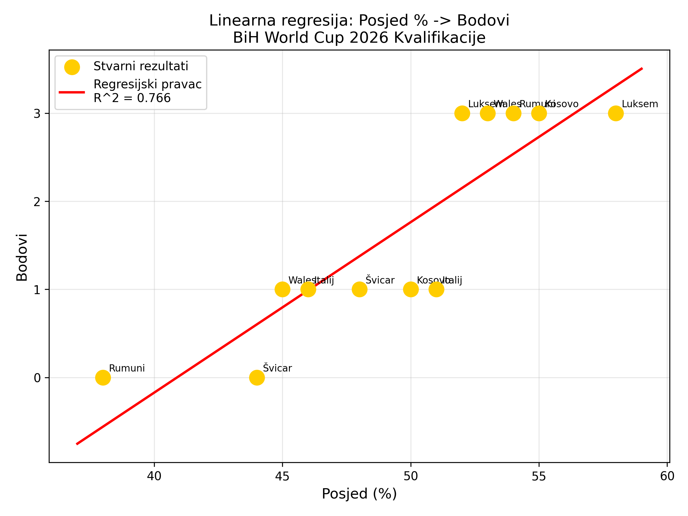
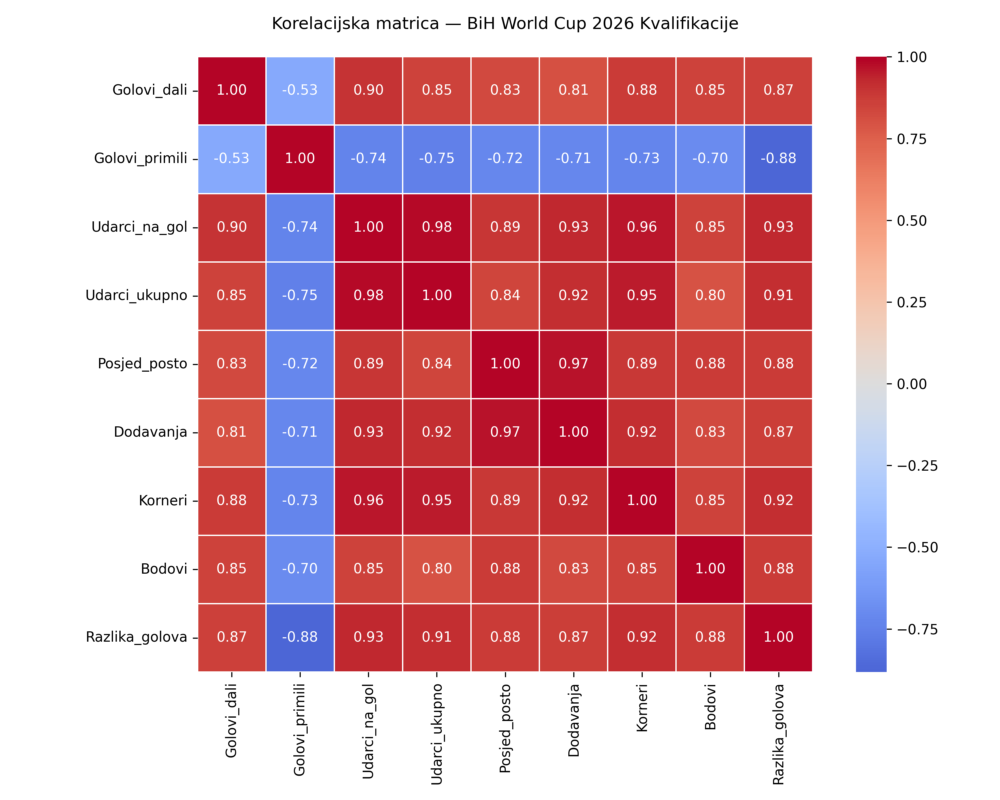
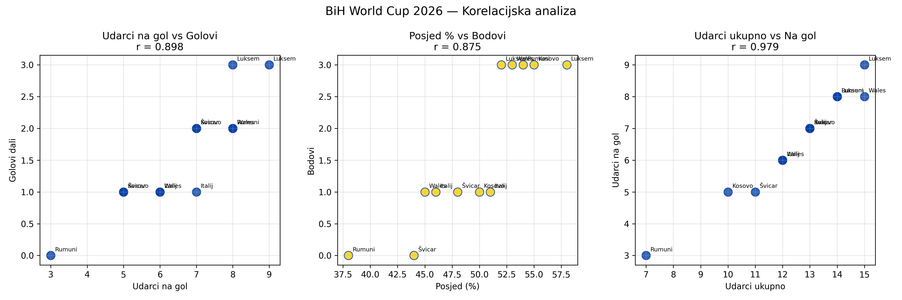
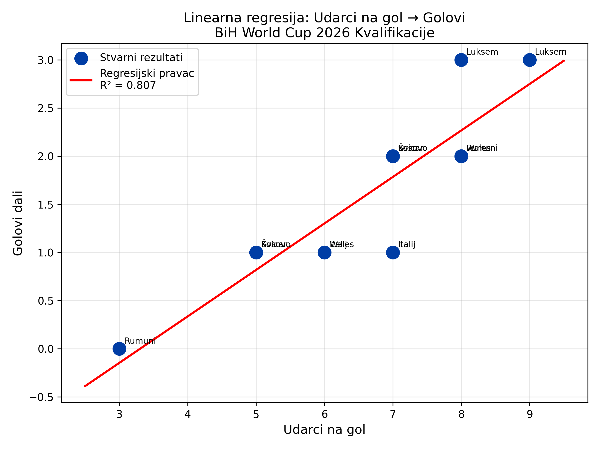

# BiH kvalifikacije: interpretacija podataka

## 1) Pokretanje `qualifications.py`
Kod je pokrenut i grafikoni su sacuvani u `PythonDataLab13/src`:
- `correlation_heatmap.png`
- `correlation_scatterplots.png`
- `shots_on_target_vs_goals.png`
- `possession_vs_points_regression.png`

## 2) Najslabija korelacija u datasetu
Najslabija korelacija (po apsolutnoj vrijednosti) je izmedju **Golovi_dali** i **Golovi_primili**:
- r = **-0.530** (umjerena negativna veza)

## 3) Regresija: Posjed % → Bodovi
Linearna regresija pokazuje jasnu pozitivnu vezu izmedju posjeda i osvojenih bodova:
- Jednadzba: **Bodovi = 0.194 × Posjed_posto - 7.914**
- R^2 = **0.766** (oko 76.6% varijance bodova objasnjava posjed)
- p-vrijednost = **0.0002** (statisticki znacajno)

## 4) Koja varijabla najvise predvidja pobjedu?
Najjaci prediktor bodova (pobjede) je **Razlika_golova**, sa najvecom korelacijom sa varijablom **Bodovi**:
- r = **0.881** (vrlo jaka pozitivna veza)

## Vizualizacije

### Korelacijska matrica

### Korelacijski scatter plotovi

### Regresija: Udarci na gol → Golovi

## Finalni osvrt
- Vise udaraca na gol i veca razlika golova najvise prate osvajanje bodova.
- Posjed lopte je znacajan, ali ne objasnjava sve rezultate; i dalje su presudni konkretni golovi.
- Najslabija veza je izmedju postignutih i primljenih golova, sto ima smisla jer su to odvojene dimenzije igre.

